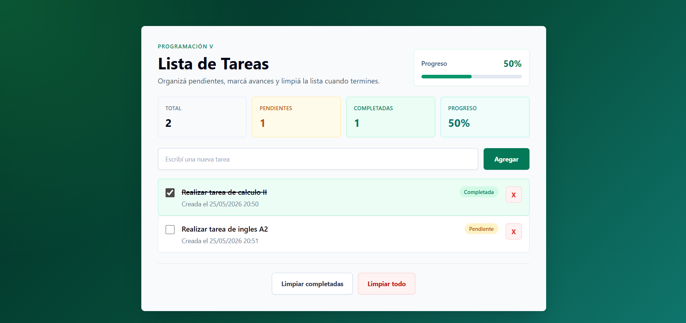

# ToDo List - Angular

Trabajo practico desarrollado para la materia **Programacion V** de la Licenciatura en Sistemas de Informacion.

La aplicacion permite administrar una lista de tareas desde una interfaz responsive creada con Angular y Tailwind CSS.

## Captura de Pantalla



## Funcionalidades

- Crear nuevas tareas.
- Guardar las tareas en un arreglo manejado por un servicio.
- Marcar tareas como completadas o pendientes.
- Eliminar tareas individuales.
- Limpiar todas las tareas completadas.
- Limpiar toda la lista.
- Mostrar la fecha y hora de creacion de cada tarea.
- Visualizar tareas totales, pendientes y completadas.
- Calcular y mostrar el porcentaje de progreso.
- Interfaz responsive con estilos realizados en Tailwind CSS.

## Tecnologias Utilizadas

- Angular
- TypeScript
- Tailwind CSS
- Git / GitHub

## Estructura Principal

```txt
src/app/
  core/
    models/
      todo.model.ts
    services/
      todo.service.ts

  features/
    todos/
      components/
        todo-form/
        todo-item/
        todo-list/
        todo-stats/
      pages/
        todo-page/
```

## Componentes

**TodoPageComponent**  
Pagina principal de la aplicacion. Integra el formulario, las estadisticas, la lista de tareas y las acciones generales.

**TodoFormComponent**  
Formulario para ingresar una nueva tarea.

**TodoListComponent**  
Componente encargado de renderizar el listado de tareas.

**TodoItemComponent**  
Representa una tarea individual. Permite marcarla como completada o eliminarla.

**TodoStatsComponent**  
Muestra los contadores de tareas totales, pendientes, completadas y el porcentaje de progreso.

## Modelo de Datos

Cada tarea utiliza la siguiente estructura:

```ts
export interface Todo {
  id: number;
  title: string;
  completed: boolean;
  createdAt: Date;
}
```

## Ejecucion del Proyecto

Instalar dependencias:

```bash
npm install
```

Ejecutar el servidor de desarrollo:

```bash
npm start
```

Abrir en el navegador:

```txt
http://localhost:4200
```

## Build

Para generar una version de produccion:

```bash
npm run build
```

## Autor

Alumno: Luciano Agüero  
Materia: Programacion V  
Carrera: Licenciatura en Sistemas de Informacion
